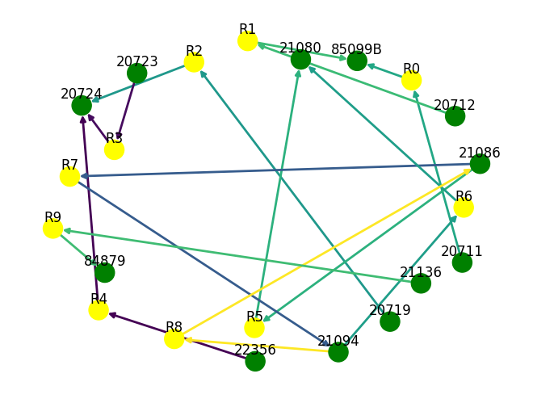
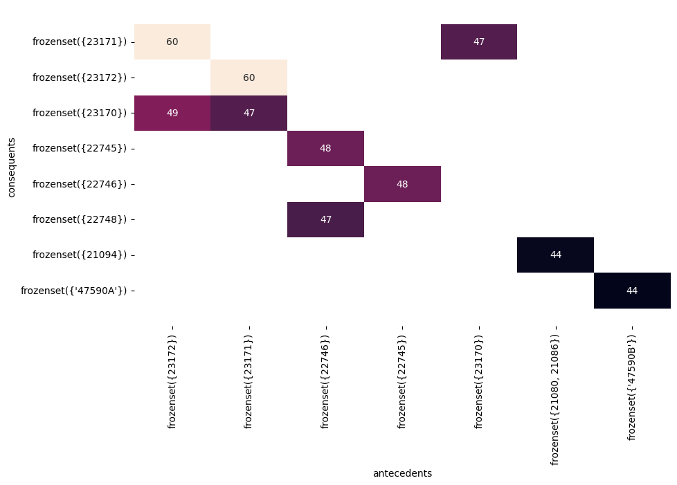
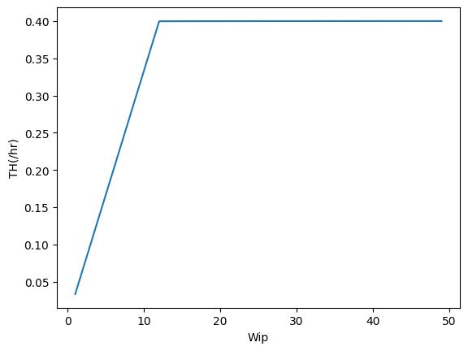
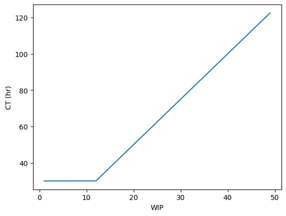

# Manufacturing Data Science Assignment 1

## Question 1: Linear Regression Analysis for Wine Quality 
For the attached red wine dataset (MDS_Assignment1_winequality.xlsx), please use “multiple regression” to find the potential linear pattern (i.e., linear regression equation) for 1599 observations  with 11 input variables and 1 output variable (label variable is regarded as continuous variable). Please answer the following questions by using Python software and 
package: 

### (a) Show the results of regression analysis as follows
* Regression output:

|                      | estimate | std. err | t-value | p-value |
|----------------------|----------|----------|---------|---------|
| Intercept            | 21.9652  | 21.195   | 1.036   | 0.300   |
| fixed acidity        | 0.0250   | 0.026    | 0.963   | 0.336   |
| volatile acidity     | -1.0836  | 0.121    | -8.948  | 0.000   |
| citric acid          | -0.1826  | 0.147    | -1.240  | 0.215   |
| residual sugar       | 0.0163   | 0.015    | 1.089   | 0.276   |
| chlorides            | -1.8742  | 0.419    | -4.470  | 0.000   |
| free sulfur dioxide  | 0.0044   | 0.002    | 2.009   | 0.045   |
| total sulfur dioxide | -0.0033  | 0.001    | -4.480  | 0.000   |
| density              | -17.8812 | 21.633   | -0.827  | 0.409   |
| pH                   | -0.4137  | 0.192    | -2.159  | 0.031   |
| sulphates            | 0.9163   | 0.114    | 8.014   | 0.000   |
| alcohol              | 0.2762   | 0.026    | 10.429  | 0.000   |

R-squared: 0.361, Adjusted R-squared: 0.356

```
                            OLS Regression Results                            
==============================================================================
Dep. Variable:                quality   R-squared:                       0.361
Model:                            OLS   Adj. R-squared:                  0.356
Method:                 Least Squares   F-statistic:                     81.35
Date:                Tue, 03 Oct 2023   Prob (F-statistic):          1.79e-145
Time:                        12:16:39   Log-Likelihood:                -1569.1
No. Observations:                1599   AIC:                             3162.
Df Residuals:                    1587   BIC:                             3227.
Df Model:                          11                                         
Covariance Type:            nonrobust                                         
========================================================================================
                           coef    std err          t      P>|t|      [0.025      0.975]
----------------------------------------------------------------------------------------
const                   21.9652     21.195      1.036      0.300     -19.607      63.538
fixed acidity            0.0250      0.026      0.963      0.336      -0.026       0.076
volatile acidity        -1.0836      0.121     -8.948      0.000      -1.321      -0.846
citric acid             -0.1826      0.147     -1.240      0.215      -0.471       0.106
residual sugar           0.0163      0.015      1.089      0.276      -0.013       0.046
chlorides               -1.8742      0.419     -4.470      0.000      -2.697      -1.052
free sulfur dioxide      0.0044      0.002      2.009      0.045       0.000       0.009
total sulfur dioxide    -0.0033      0.001     -4.480      0.000      -0.005      -0.002
density                -17.8812     21.633     -0.827      0.409     -60.314      24.551
pH                      -0.4137      0.192     -2.159      0.031      -0.789      -0.038
sulphates                0.9163      0.114      8.014      0.000       0.692       1.141
alcohol                  0.2762      0.026     10.429      0.000       0.224       0.328
==============================================================================
Omnibus:                       27.376   Durbin-Watson:                   1.757
Prob(Omnibus):                  0.000   Jarque-Bera (JB):               40.965
Skew:                          -0.168   Prob(JB):                     1.27e-09
Kurtosis:                       3.708   Cond. No.                     1.13e+05
==============================================================================
```

### (b) The fitting of the linear regression is a good idea? If yes, why? If no, why? What’s the possible reason of poor fitting? 

Based on the R-squared and adjusted R-squared values, the model can only account for 30% of the variance in the data. This is clearly not a favorable result. Upon examining the table, it becomes apparent that the p-values of six variables in the dataset exceed the threshold of 0.01. Consequently, the presence of variables that the model cannot adequately explain may adversely impact its overall interpretability. Furthermore, it is imperative to assess whether the data meets the three assumptions of regression.

### (c) Based on the results, rank the independent variables by p-values and which one are statistically significant variables with p-values<0.01?
* Ranked Independent Variables: alcohol, volatile acidity, sulphates, total sulfur dioxide, chlorides, pH, free sulfur dioxide, citric acid, residual sugar, fixed acidity, density
* Statistically Significant Variables (p-values<0.01): alcohol, volatile acidity, sulphates, total sulfur dioxide, chlorides

### (d) Testify the underlying assumptions of regression (1) Normality, (2) Independence, and (3) Homogeneity of Variance with respect to residual.

By observing the `model.summary()` text in problem 1-1, we can conclude that:
* Normality: The p-value of Omnibus test and JB test are both smaller than 0.001, so it appears that the assumption of normality of residuals is violated.
* Independence: The Durbin-Watson statistic of 1.757 falls outside the interval of 1.870-1.898 provided by the Durbin-Watson Table for n = 1600 and k = 11. This suggests the presence of potential positive autocorrelation in the residuals. 
    
    source: https://real-statistics.com/statistics-tables/durbin-watson-table/
* Homogeneity: The p-value of the White Test is way below 0.01, indicating rejection to null hypothesis. The residuals have Heteroscedasticity.


## Question 2: Association Rule- Market Basket Analysis
### (a) How to handle the raw dataset via data preprocessing?

To prepare the data for the Apriori Algorithm, it's essential to group it by `"InvoiceNo"` and perform one-hot encoding on `"StockCode"`. Additionally, removing other columns helps enhance execution time.

### (b) Define and what’s the top 10 association rules? Show the support, confidence, and lift to each specific rule, respectively?

| antecedents               | consequents           |   support |   confidence |   lift |
|:--------------------------|:----------------------|----------:|-------------:|-------:|
| 23172        | 23171    | 0.010888  |     0.898089 |     60 |
| 23171        | 23172    | 0.010888  |     0.73057  |     60 |
| 23172        | 23170    | 0.0105019 |     0.866242 |     49 |
| 22746        | 22745    | 0.0101158 |     0.793939 |     48 |
| 22745        | 22746    | 0.0101158 |     0.615023 |     48 |
| 23171        | 23170    | 0.0124324 |     0.834197 |     47 |
| 22746        | 22748    | 0.0101544 |     0.79697  |     47 |
| 23170        | 23171    | 0.0124324 |     0.704595 |     47 |
| 21080, 21086 | 21094    | 0.0102317 |     0.89527  |     44 |
|  47590A      |  47590B  | 0.0101931 |     0.671756 |     44 |

Association Rules Filtering Procedure:
1. Apply the Apriori Algorithm to identify frequent itemsets with a minimum support of 0.01. The slight adjustment was made to accommodate memory limitations.
2. Further refine the results by filtering with a minimum confidence threshold of 0.6.
3. Eliminate association rules that involve single items (1-itemset).
4. Sort the remaining rules based on two criteria: `'lift'` and `'confidence'`. For `'lift'`, round the values to integers to prioritize improved confidence while maintaining a similar level of lift.

### (c) Please provide/guess the “story” to interpret one of top-10 rules you are interested in (Third column in dataset shows item Description).

* Select the Rule with two antecedents: Choose the highest-ranked association rule involving `'SET/20 RED RETROSPOT PAPER NAPKINS' (21080)` and `'SET/6 RED SPOTTY PAPER CUPS' (21086)` related to `'SET/6 RED SPOTTY PAPER PLATES' (21094)`.
* Story Explanation: The rule suggests a connection between these three items. Specifically, it associates the "Red Retrospot" style with a lively and celebratory ambiance. Additionally, it highlights the utility of napkins, paper cups and paper plates, commonly used in settings like restaurants, parties, or banquets. Therefore, we can interpret this rule as indicating that individuals planning events or gatherings with a festive atmosphere are likely to purchase both of these items for their food and beverage needs.

### (d) Give a visualization graph of your association rules

Here provides a visualization of the rules:


And a heatmap with lift:



## Question 3: Manufacturing System Analysis
### (a) 根據 Little’s Law，試計算各工作站的產出率 TH 於下表；試問瓶頸站的產出率 𝑟𝑏、最小生產週期時間(總加工時間，𝑇0)、關鍵在製品水準(𝑊0)各為多少？

| 工作站編號  | 平行等效機台數  |加工時間(小時) |工作站的產能 TH(個/小時) |
|:-------------:|:------------:|:----------:|:-------------:|
| 1        | 5    | 7  |     5/7 |
| 2        | 2    | 3  |    2/3  |
| 3        | 6    | 15 |     2/5 |
| 4        | 3    | 5 |     3/5 |

瓶頸站為編號3，瓶頸站的產出率 𝑟𝑏 = 0.4, 𝑇0 = 30, 𝑊0 = 12

### (b) 試給出最佳績效(best case)下，最大的產出率(THbest)與最小生產週期時間(CTbest)的計算公式(提示：參閱講義)
```python
def CTbest(w):
    if(w <= W_0): return T_0
    else: return w / r_b

def THbest(w):
    if(w <= W_0): return w / T_0
    else: return r_b
```
### (c) 根據該問題的產線，試程式撰寫建立一模擬模型(或用套裝軟體、數值分析)來驗證，當在製品 WIP 數量超過工廠產能時，其生產週期將嚴重惡化。也就是當產線的投料速度(投產量)大於產線的產出率，此時生產系統將處於非穩態的狀態(non-steady state)。試用圖表呈現 WIP、CT 與 TH 之間惡化的關係。(提示：參閱講義)

本模擬週期為放進 1000 倍的當前在製品數量（例如若在製品為 5，則在產線始終維持 5 個在製品的狀況下陸續放進 5000 個在製品，跑完 1000 個週期），並且於最後一個產品生產完成之後結束，以得到合理的 CT，減少受到前幾批次的在製品的週期影響，由下面兩張折線圖可以發現，𝑊0 為 12，THbest 約為 0.3999，CTbest 約 30.01 小時，與先前第一小題得出的理論值相符。



